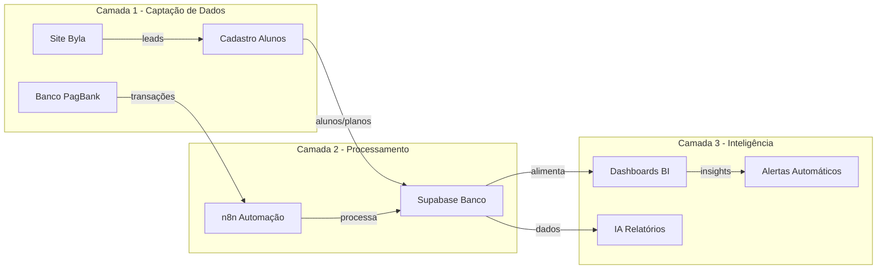
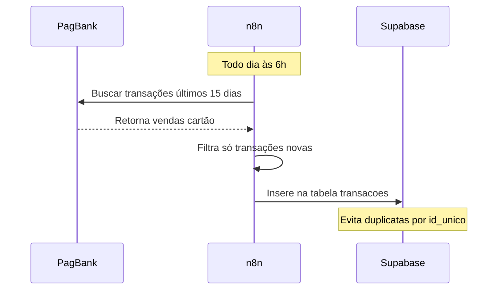
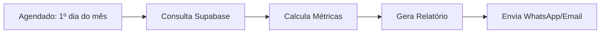
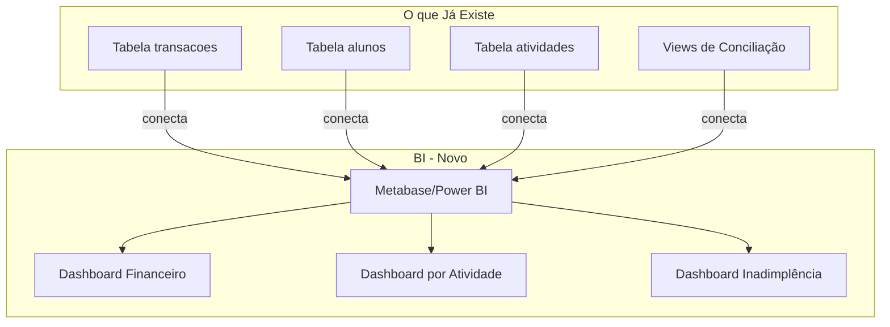
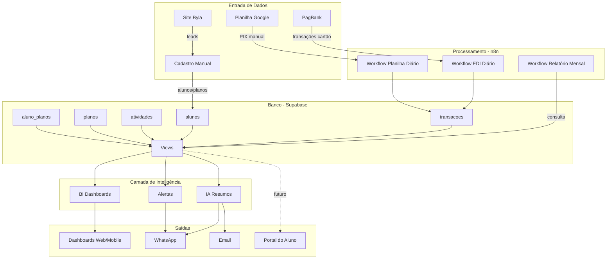

# Apresentação do Sistema Byla - Proposta Completa

**Para:** Donos do Espaço Byla  
**Assunto:** Sistema de Gestão Financeira e Operacional Automatizado

---

## O Problema que Estamos Resolvendo

Hoje, espaços como a Byla enfrentam:

1. **Controle financeiro manual** – conferir quem pagou, quanto entrou, planilhas desatualizadas
2. **Tempo perdido** – horas por mês conferindo extrato bancário com lista de alunos
3. **Falta de visão** – difícil saber "quanto entrou de Pilates vs Dança", "qual mês foi melhor"
4. **Inadimplência** – descobrir tarde que alguém não pagou
5. **Decisões no escuro** – contratar professor, investir em nova atividade, sem dados concretos

---

## A Solução: Sistema Automatizado em 3 Camadas

---

## O que Já Foi Implementado

### 1. Site Institucional (Landing Page)
**Tecnologia:** React + Tailwind CSS  
**O que tem:**
- Apresentação do espaço
- Descrição das salas (Atendimentos, Movimento, Teatro)
- Tabela de valores de locação
- Localização e contato
- Design moderno e responsivo

**Resultado:** Presença digital profissional para atrair clientes.

### 2. Captura Automática de Transações
**Tecnologia:** n8n (automação) + PagBank EDI API + Supabase (banco)

**Como funciona:**

**O que captura:**
- Vendas em **cartão** (crédito/débito) da maquininha
- Data, valor, forma de pagamento
- **Automático:** roda todo dia, sem intervenção manual

**Para PIX:**
- Você exporta o extrato do app PagBank (fim do mês)
- Cola na planilha Google (aba "Importar")
- O n8n processa e insere automaticamente
- **Resultado:** PIX com nome do pagador também entra na base

### 3. Banco de Dados Estruturado
**Tecnologia:** PostgreSQL (Supabase)

**Tabelas implementadas:**

| Tabela | O que guarda | Exemplo |
|--------|--------------|---------|
| **transacoes** | Tudo que entra/sai do banco | 2025-02-20, Maria Silva, R$ 230, PIX, entrada |
| **atividades** | Modalidades do espaço | Pilates, Dança, Teatro |
| **alunos** | Cadastro de alunos | João Silva, (71) 99999-9999 |
| **planos** | Produtos/mensalidades | Mensalidade Pilates R$ 230/mês |
| **aluno_planos** | Quem faz o quê, paga como | João → Pilates → R$ 230 → PIX (pagador: Maria) |

**Views (consultas prontas):**
- `v_entradas_oficial` – todas as entradas do banco
- `v_resumo_mensal_oficial` – totais por mês (entrada, saída, saldo)
- `v_reconciliacao_mensalidades` – quem pagou vs quem deveria pagar
- `v_alunos_por_atividade` – lista de alunos por modalidade
- `v_mensalidades_por_atividade` – pagamentos divididos por Pilates, Dança, etc.

---

## O que o Banco de Dados Alimenta

### 1. Dashboards de BI (Business Intelligence)

**Ferramenta:** Metabase (grátis, open source) ou Power BI

**Painéis que você terá:**

#### Dashboard 1: Visão Geral Financeira
- **Gráfico de linha:** Evolução da receita (últimos 6 meses)
- **Gráfico de barras:** Entradas x Saídas por mês
- **KPI cards:** Total entradas mês, Total saídas mês, Saldo mês, Variação vs mês anterior
- **Gráfico pizza:** Receita por forma de pagamento (PIX, Débito, Crédito)

#### Dashboard 2: Receita por Atividade
- **Gráfico de barras:** Quanto entrou de Pilates, Dança, Teatro, etc.
- **Tabela:** Alunos ativos por atividade
- **Gráfico de linha:** Evolução de alunos por modalidade
- **KPI:** Ticket médio por atividade

#### Dashboard 3: Conciliação e Inadimplência
- **Tabela:** Mensalidades confirmadas no banco (verde)
- **Tabela:** Mensalidades pendentes (vermelho)
- **Lista:** Alunos com pagamento em atraso
- **KPI:** Taxa de adimplência (%)

#### Dashboard 4: Operacional
- **Ocupação de salas** (quando integrar agenda)
- **Receita por sala** (locações avulsas vs mensalidades)
- **Saídas por categoria** (professores, manutenção, etc.)

**Como funciona:**
1. O BI conecta **direto no Supabase** (PostgreSQL)
2. Lê as **tabelas e views** que já existem
3. Você monta os gráficos arrastando campos (sem código)
4. Os dashboards **atualizam sozinhos** (sempre mostram dados atuais)

### 2. Relatórios Automáticos

**Workflow n8n (novo):**

**Relatório gerado automaticamente:**
- Total de entradas e saídas do mês
- Comparação com mês anterior (cresceu ou caiu?)
- Receita por atividade
- Lista de inadimplentes
- Enviado por **WhatsApp** ou **Email** todo dia 1º do mês

### 3. Controle de Inadimplência

**View pronta:** `v_reconciliacao_mensalidades`

**O que mostra:**
- Aluno, atividade, valor da mensalidade, data esperada
- Status: **Confirmado** (tem transação no banco) ou **Pendente**
- Quem pagou e quem não pagou

**Uso prático:**
- Todo dia 5 do mês: rodar a view e ver quem não pagou
- Workflow n8n pode gerar lista automática e enviar para você
- Ou o BI mostra em tempo real no dashboard

---

## Como a Inteligência Artificial Ajuda

### 1. Resumos Executivos em Linguagem Natural

**Sem IA (hoje):**
- Você olha tabelas, gráficos, números
- Precisa interpretar e tirar conclusões

**Com IA:**
- O sistema envia os dados para uma IA (ChatGPT, Claude)
- A IA gera um texto executivo:

> "Fevereiro de 2025 teve receita de R$ 12.500, crescimento de 8% vs janeiro. Pilates continua sendo a atividade mais rentável (R$ 6.900, 55% da receita). Houve 3 inadimplências (João, Maria e Pedro). Recomendo: (1) enviar lembrete aos 3, (2) considerar desconto para pagamento antecipado em março."

**Implementação:**
- Workflow n8n que:
  1. Busca dados do mês no Supabase
  2. Envia para API da IA com prompt estruturado
  3. Recebe o resumo em texto
  4. Envia por WhatsApp/Email

### 2. Categorização Automática de Despesas

**Problema:** Quando você paga algo, a transação vem como "Transferência PIX" ou "Débito Loja X".

**Com IA:**
- O sistema pega a descrição da transação
- Pergunta para a IA: "Isso é Manutenção, Salário, Material ou o quê?"
- A IA responde: "Salário"
- O sistema grava a categoria automaticamente

**Resultado:** Relatórios por categoria (quanto gastou em Salários, Manutenção, etc.) sem você precisar classificar manualmente.

### 3. Detecção de Anomalias

**Exemplo:**
- João sempre paga R$ 230 em Pilates
- Um mês ele paga R$ 115
- A IA detecta: "Valor abaixo do esperado para João (Pilates). Verificar se foi meia mensalidade ou erro."

**Ou:**
- Despesa de R$ 5.000 aparece (muito acima da média)
- A IA alerta: "Gasto atípico detectado. Confirmar se está correto."

### 4. Previsão de Receita (Machine Learning)

**Com histórico de 6-12 meses:**
- A IA analisa padrões (sazonalidade, crescimento)
- Prevê: "Março tende a ter receita 10% maior que fevereiro (baseado nos últimos 2 anos)"
- Ajuda no planejamento (quando contratar, quando investir)

---

## Como Apresentar para os Donos da Byla

### Estrutura da Apresentação (Slides ou Reunião)

#### Slide 1: O Desafio
"Controlar finanças de um espaço com várias atividades é complexo e toma tempo."

#### Slide 2: A Solução
"Sistema automatizado que captura transações, concilia com alunos e gera relatórios."

#### Slide 3: O que Já Funciona (Demo)
- Mostrar o **site** (landing page)
- Mostrar a **tabela transacoes** no Supabase (dados reais)
- Mostrar o **workflow n8n** rodando
- Mostrar uma **view de conciliação** (quem pagou vs quem deveria)

#### Slide 4: O que Vem a Seguir (Roadmap)
- **Mês 1:** BI com dashboards (fluxo de caixa, receita por atividade)
- **Mês 2:** Relatórios automáticos por WhatsApp
- **Mês 3:** Controle de inadimplência com alertas
- **Futuro:** Portal do aluno, IA para insights

#### Slide 5: Benefícios Concretos
- **Economia de tempo:** 10-15 horas/mês que você gasta conferindo manualmente
- **Decisões melhores:** saber qual atividade investir, quando contratar
- **Profissionalização:** sistema de nível corporativo, sem custo de ERP
- **Escalabilidade:** adicionar novas atividades, novos alunos, sem retrabalho

#### Slide 6: Custos
- **Supabase:** grátis até 500 MB (suficiente para anos)
- **n8n:** self-hosted grátis (ou cloud ~$20/mês)
- **Metabase:** grátis (open source)
- **Total:** R$ 0-100/mês vs R$ 500-2000/mês de sistemas prontos

#### Slide 7: Próximos Passos
"Vamos implementar o BI este mês e mostrar os primeiros dashboards."

---

## Demonstração Prática (O que Mostrar)

### 1. Site (30 segundos)
- Abrir `http://localhost:5173` (ou o deploy)
- Mostrar: "Este é o site que atrai clientes. Moderno, responsivo, com todas as informações."

### 2. Banco de Dados (2 minutos)
- Abrir o **Supabase** → Table Editor → tabela **transacoes**
- Mostrar: "Aqui estão todas as transações do banco. Veja: data, pessoa, valor, se é entrada ou saída."
- Abrir a view **v_resumo_mensal_oficial**
- Mostrar: "Este é o resumo por mês: quanto entrou, quanto saiu, saldo. Calculado automaticamente."

### 3. Automação (2 minutos)
- Abrir o **n8n** → workflow **PagBank EDI para Supabase**
- Clicar em **Execute Workflow**
- Mostrar: "Isso roda todo dia às 6h. Busca as transações do banco e grava aqui. Sem intervenção manual."
- Mostrar o nó **Só novos**: "Evita duplicatas. Só entra o que ainda não existe."

### 4. Conciliação (2 minutos)
- Abrir a view **v_reconciliacao_mensalidades** no Supabase
- Mostrar: "Aqui a gente vê: João pagou R$ 230 no dia 20, confirmado no banco. Maria está pendente."
- Explicar: "Isso que você faz na mão hoje, conferindo lista com extrato, o sistema faz sozinho."

### 5. Próximo Passo: BI (3 minutos)
- Mostrar um **mockup** ou **exemplo** de dashboard (pode ser imagem de exemplo do Metabase/Power BI)
- Explicar: "Com esses dados que já temos, vamos criar painéis assim:"
  - Gráfico de receita mensal
  - Receita por atividade (Pilates, Dança, etc.)
  - Lista de inadimplentes
- "Você abre no celular ou computador e vê tudo atualizado em tempo real."

---

## Como o BI se Integra com o que Já Foi Feito

### Conexão Direta

**Passo a passo da integração:**

1. **Instalar Metabase** (ou usar Power BI Desktop)
2. **Conectar no Supabase:**
   - Tipo: PostgreSQL
   - Host: `db.flbimmwxxsvixhghmmfu.supabase.co`
   - Port: 5432
   - Database: `postgres`
   - User/Password: do Supabase (Settings → Database)
3. **Criar fontes de dados:**
   - Apontar para as **views** (`v_resumo_mensal_oficial`, `v_entradas_oficial`, `v_reconciliacao_mensalidades`, etc.)
4. **Montar dashboards:**
   - Arrastar campos para gráficos (sem código)
   - Ex.: "Gráfico de linha: eixo X = mês, eixo Y = total_entradas"
5. **Publicar:**
   - Você acessa via navegador (desktop ou celular)
   - Sempre atualizado (lê direto do banco)

**Tempo para implementar:** 1-2 dias (configurar + montar 3-4 dashboards).

---

## Como a Inteligência Artificial Ajuda

### 1. Relatórios em Linguagem Natural (Executivo)

**Antes (sem IA):**
- Você abre o BI, vê gráficos, tabelas
- Precisa interpretar: "Ah, Pilates cresceu 10%, Dança caiu 5%"
- Escreve um resumo manualmente

**Com IA:**
- O sistema pega os dados do mês
- Envia para a IA (ex.: ChatGPT API)
- A IA gera um texto executivo:

> **Resumo Executivo - Fevereiro 2025**
>
> A receita total foi de R$ 12.500, representando crescimento de 8% em relação a janeiro. Pilates continua sendo a principal fonte de receita (R$ 6.900, 55% do total), seguido por Dança (R$ 3.200, 26%) e locações avulsas (R$ 2.400, 19%).
>
> Houve 3 inadimplências este mês (João Silva, Maria Santos, Pedro Oliveira), totalizando R$ 690 pendentes. Recomendo contato imediato para regularização.
>
> Destaque positivo: 2 novos alunos em Dança, indicando potencial de crescimento nessa modalidade. Considerar turma adicional se a tendência continuar.
>
> Despesas do mês: R$ 8.200 (salários R$ 6.000, manutenção R$ 1.500, materiais R$ 700). Saldo operacional: R$ 4.300.

**Implementação:**
- Workflow n8n que roda dia 1º do mês
- Busca dados no Supabase
- Envia para API da IA (OpenAI, Claude, Gemini)
- Recebe o texto
- Envia por WhatsApp ou Email

**Custo:** ~R$ 5-20/mês (API da IA, dependendo do uso).

### 2. Categorização Automática de Despesas

**Problema:**
- Você paga o professor: aparece "Transferência PIX - João Silva"
- Você paga manutenção: aparece "Débito - Loja ABC"
- Manualmente você precisa anotar: "isso é salário", "isso é manutenção"

**Com IA:**
- A transação entra no sistema
- A IA analisa: "Transferência PIX - João Silva, R$ 2000"
- A IA sabe que João é professor (do contexto ou de transações anteriores)
- Categoriza automaticamente: **"Salário"**

**Resultado:**
- Relatórios por categoria (quanto gastou em Salários, Manutenção, Materiais) sem trabalho manual
- No BI: gráfico "Despesas por Categoria" atualizado sozinho

### 3. Alertas Inteligentes

**Exemplos:**

- **Anomalia de valor:** "Maria sempre paga R$ 230. Este mês pagou R$ 115. Verificar se foi meia mensalidade ou erro."
- **Atraso:** "Pedro não pagou há 15 dias. Histórico dele: sempre paga até dia 5. Sugestão: enviar lembrete."
- **Oportunidade:** "Dança teve 3 novos alunos em fevereiro. Considerar abrir turma extra às quintas."
- **Risco:** "Receita de março está 20% abaixo da previsão. Revisar estratégia de captação."

**Como funciona:**
- A IA analisa os dados (histórico, padrões)
- Compara com o esperado
- Gera alertas quando detecta algo relevante
- Envia notificação (WhatsApp, email, dashboard)

### 4. Assistente Virtual (Futuro)

**Você pergunta (via WhatsApp ou chat):**
- "Quanto entrou de Pilates em fevereiro?"
- "Quem não pagou este mês?"
- "Qual a receita média dos últimos 6 meses?"

**A IA responde:**
- Consulta o banco
- Processa os dados
- Responde em texto: "Pilates teve R$ 6.900 em fevereiro. Média dos últimos 6 meses: R$ 6.500."

**Implementação:** Chatbot conectado ao Supabase + IA para processar linguagem natural.

---

## Arquitetura Completa do Sistema

---

## Cronograma de Implementação

### Já Implementado (Semanas 1-4)
- [x] Site institucional (React)
- [x] Estrutura do banco (Supabase)
- [x] Captura automática de transações (n8n + PagBank EDI)
- [x] Workflow planilha para PIX
- [x] Views de conciliação
- [x] Schema de atividades/alunos/planos

### Próximas 2 Semanas: BI
- [ ] Instalar/configurar Metabase (ou Power BI)
- [ ] Conectar no Supabase
- [ ] Criar 3 dashboards principais:
  1. Visão Geral Financeira
  2. Receita por Atividade
  3. Conciliação/Inadimplência
- [ ] Treinamento: como usar os dashboards

### Próximas 4 Semanas: Relatórios Automáticos
- [ ] Workflow de relatório mensal (n8n)
- [ ] Template de relatório (HTML/texto)
- [ ] Integração com WhatsApp (Evolution API ou Twilio)
- [ ] Teste: envio automático dia 1º do mês

### Próximas 6 Semanas: IA
- [ ] Integração com API de IA (OpenAI ou Claude)
- [ ] Resumo executivo mensal automático
- [ ] Categorização automática de despesas
- [ ] Alertas inteligentes (anomalias, inadimplência)

### Futuro (3-6 meses)
- [ ] Portal do aluno (login, ver mensalidades)
- [ ] Assistente virtual (chatbot)
- [ ] Previsão de receita (ML)
- [ ] Integração com agenda (ocupação de salas)

---

## Investimento vs Retorno

### Custo do Sistema

| Item | Custo Mensal | Observação |
|------|--------------|------------|
| Supabase | R$ 0 | Grátis até 500 MB (suficiente para 2-3 anos) |
| n8n | R$ 0-100 | Self-hosted grátis; cloud ~$20/mês |
| Metabase | R$ 0 | Open source, self-hosted |
| IA (OpenAI/Claude) | R$ 20-50 | Só se usar resumos automáticos |
| **Total** | **R$ 0-150/mês** | vs R$ 500-2000/mês de ERPs prontos |

### Retorno (Economia + Valor)

| Benefício | Valor Estimado |
|-----------|----------------|
| **Tempo economizado** | 10-15h/mês × R$ 50/h = R$ 500-750/mês |
| **Redução de inadimplência** | Alertas antecipados = +5-10% de recuperação = R$ 300-600/mês |
| **Decisões melhores** | Investir na atividade certa, contratar no momento certo = difícil quantificar, mas impacto alto |
| **Profissionalização** | Credibilidade, organização, escalabilidade = valor intangível |

**ROI:** Sistema se paga em menos de 1 mês (considerando tempo economizado).

---

## Comparação: Byla Hoje vs Byla com o Sistema Completo

| Aspecto | Hoje (Manual) | Com o Sistema |
|---------|---------------|---------------|
| **Conferir quem pagou** | 2-3 horas/mês (manual, planilha) | Automático (view de conciliação) |
| **Saber quanto entrou no mês** | Somar no extrato ou planilha | Dashboard em tempo real |
| **Receita por atividade** | Não tem (ou planilha manual) | Dashboard: Pilates R$ X, Dança R$ Y |
| **Inadimplência** | Descobrir tarde | Alerta automático dia 5 do mês |
| **Relatórios para decisão** | Não tem | Dashboards + resumo executivo IA |
| **Previsão de receita** | Não tem | IA prevê com base no histórico |
| **Custo** | Tempo (10-15h/mês) | R$ 0-150/mês + setup inicial |

---

## Perguntas que os Donos Podem Fazer (e as Respostas)

### "Isso é muito complexo?"
**R:** Não. O sistema já está montado. Você só precisa:
1. Exportar o extrato do PagBank 1x por mês (5 minutos)
2. Colar na planilha Google (2 minutos)
3. O resto é automático

### "E se eu quiser mudar algo?"
**R:** O sistema é modular. Quer adicionar uma nova atividade? É só inserir na tabela `atividades`. Quer mudar o horário do workflow? É um clique no n8n. Tudo é configurável.

### "Preciso de conhecimento técnico?"
**R:** Para **usar**, não. Os dashboards são visuais (clica e vê). Para **ajustar** (ex.: adicionar um gráfico novo), pode precisar de suporte técnico (ou eu faço).

### "E se o sistema parar de funcionar?"
**R:** 
- O n8n tem **logs** de cada execução (você vê se deu erro)
- O Supabase tem **backup automático**
- Posso configurar **alertas** (se o workflow falhar, você recebe notificação)

### "Quanto tempo leva para implementar tudo?"
**R:** 
- **Já pronto:** captura de transações, banco, views (4 semanas já investidas)
- **BI:** 1-2 semanas
- **Relatórios automáticos:** 2-3 semanas
- **IA:** 2-3 semanas
- **Total para sistema completo:** 2-3 meses

### "Vale a pena?"
**R:** Sim. Você economiza 10-15 horas/mês, reduz inadimplência, toma decisões melhores. O custo é quase zero. E o sistema escala: funciona com 20 alunos ou com 200.

---

## Próximos Passos Imediatos

1. **Esta semana:** Finalizar captura de transações (testar com dados reais, confirmar que PIX pela planilha funciona)
2. **Próximas 2 semanas:** Implementar BI (Metabase + 3 dashboards)
3. **Apresentar:** Mostrar os dashboards funcionando com dados reais da Byla
4. **Decidir:** Seguir para relatórios automáticos + IA ou parar no BI (já entrega muito valor)

---

## Materiais para a Apresentação

### O que Preparar

1. **Slides (PowerPoint/Google Slides):**
   - Problema → Solução → Demo → Benefícios → Roadmap → Custos
   - 7-10 slides, 10-15 minutos

2. **Demo ao vivo:**
   - Site (30s)
   - Supabase: tabela transacoes + view de conciliação (2 min)
   - n8n: workflow rodando (2 min)
   - Mockup de dashboard BI (2 min)

3. **Documento técnico (este arquivo):**
   - Deixar com eles para ler depois
   - Detalha tudo: arquitetura, custos, roadmap

4. **Proposta comercial (se for cobrar):**
   - Valor do projeto (horas × taxa)
   - Ou mensalidade de manutenção/suporte
   - Ou equity/participação (se for startup)

### Dicas para a Apresentação

- **Comece pelo problema:** "Vocês gastam quanto tempo por mês conferindo pagamentos?"
- **Mostre funcionando:** "Aqui está rodando com dados reais da Byla."
- **Foque no valor:** "Isso economiza X horas e reduz inadimplência em Y%."
- **Roadmap visual:** "Hoje temos isso; em 1 mês teremos dashboards; em 2 meses relatórios automáticos."
- **Deixe eles perguntarem:** reserve 5-10 minutos para dúvidas

---

## Resumo Final

### O que o Sistema Faz

1. **Captura transações** do banco automaticamente (cartão via API, PIX via planilha)
2. **Armazena** em banco estruturado (Supabase)
3. **Concilia** com cadastro de alunos (quem pagou vs quem deveria)
4. **Gera dashboards** (BI) para visualização em tempo real
5. **Cria relatórios** automáticos (com IA) enviados por WhatsApp/Email
6. **Alerta** sobre inadimplência e anomalias

### O que o Banco de Dados Alimenta

- **Dashboards de BI** (fluxo de caixa, receita por atividade, inadimplência)
- **Relatórios mensais** (executivo, por atividade, por aluno)
- **Alertas** (inadimplência, anomalias, oportunidades)
- **(Futuro) Portal do aluno** (histórico, próximas mensalidades)

### Como o BI se Integra

- Conecta **direto no Supabase** (PostgreSQL)
- Lê as **tabelas e views** que já existem
- Gera **gráficos e relatórios** sem código
- **Atualiza sozinho** (sempre dados atuais)

### Como a IA Ajuda

- **Resumos executivos** em linguagem natural
- **Categorização** automática de despesas
- **Alertas inteligentes** (anomalias, padrões)
- **Previsões** de receita (futuro)

### Investimento

- **Custo:** R$ 0-150/mês (vs R$ 500-2000/mês de ERPs)
- **Tempo:** 2-3 meses para sistema completo
- **Retorno:** Economia de 10-15h/mês + redução de inadimplência + decisões melhores

---

**Conclusão:** O sistema transforma a Byla de "gestão manual" para "gestão automatizada e baseada em dados", com custo baixo e escalabilidade alta. O BI e a IA são as camadas que transformam "dados no banco" em "inteligência para decisão".
