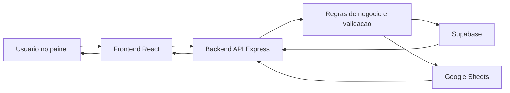

# Arquitetura do Sistema Byla

## 1. Visao do produto

O Byla e um sistema de apoio a operacao financeira e administrativa, focado em:

- acompanhamento de entradas e saidas;
- conciliacao entre planilha e banco;
- acompanhamento de vencimentos e inadimplencia;
- relatórios operacionais e gerenciais.

Ele combina duas fontes principais de dados:

- **Supabase**: fonte oficial de transacoes, despesas e visoes financeiras;
- **Google Sheets**: fonte complementar/operacional (cadastro e estrutura de pagamento por aba).

## 2. Objetivos de engenharia

- reduzir divergencias entre operacao manual e financeiro oficial;
- tornar regras de negocio explicitas e centralizadas;
- manter evolucao segura com testes e validacao de contratos;
- permitir suporte rapido com observabilidade (`x-request-id` + logs estruturados).

## 3. Requisitos

### 3.1 Funcionais (principais)

- Exibir panorama financeiro mensal (entradas, saidas, lucro).
- Validar pagamentos da planilha contra entradas no banco.
- Conciliar vencimentos por competencia e situacao (ok, atrasado, em aberto etc.).
- Gerar relatórios (diario/mensal/trimestral/anual) e texto assistido por IA.
- Expor status das fontes de dados para diagnostico operacional.

### 3.2 Nao funcionais (principais)

- **Confiabilidade de contrato**: validacao de query/body no backend (Zod).
- **Manutenibilidade**: rotas modularizadas por dominio.
- **Rastreabilidade**: `x-request-id` em respostas + logs JSON no backend.
- **Desempenho UX**: cache e estado de carregamento com TanStack Query em hooks do frontend.

## 4. Arquitetura logica

## 4.1 Frontend (`frontend/`)

- `pages/`: composicao da interface por caso de uso.
- `hooks/`: acesso a dados, estado de carregamento e erro.
- `services/`: cliente HTTP (`backendApi.ts`) e acesso direto Supabase quando necessario.
- `components/`: visualizacao (KPI, tabelas, charts, blocos de estado).

Ponto de atencao: o frontend usa resposta de erro padronizada e inclui referencia de rastreio quando recebe `x-request-id`.

## 4.2 Backend (`backend/`)

- `routes/`: endpoints por dominio (calendario, conciliacao, relatorios, fontes, transacoes etc.).
- `useCases/`: orquestracao de regras de aplicacao.
- `logic/`: regras de negocio puras e reutilizaveis (ex.: match planilha x banco).
- `adapters/` + `ports/`: integracao desacoplada (repositorios e fontes).
- `services/`: integracoes externas (Supabase, Sheets) e utilitarios.
- `validation/`: schemas e parser de entrada (Zod).

O router agregador e `backend/src/routes/api.ts`; cada modulo concentra sua responsabilidade.

## 4.3 Dados e integracoes

- Supabase: transacoes, despesas, visoes mensais e dados oficiais.
- Google Sheets: estrutura por aba, pagamentos operacionais, apoio a conciliacao.

## 5. Fluxo macro de dados

## 6. Principios de design aplicados

- **Separacao de responsabilidades**: pagina, hook, servico e rota com papeis claros.
- **Baixo acoplamento**: regras em `logic/` e contratos via `ports/`.
- **Coesao de dominio**: endpoints agrupados por contexto de negocio.
- **Contratos explicitos**: validacao centralizada evita comportamento ambiguo.
- **Evolucao segura**: testes unitarios + integracao de rotas criticas.

## 7. Limites do sistema

- O sistema nao substitui por completo processos contabeis formais.
- Dependencias externas (Supabase/Sheets) podem impactar disponibilidade; por isso existem respostas de erro e status de fonte.

## 8. Mapa rapido de modulos backend

- `calendario.ts`: calendario financeiro diario.
- `conciliacao.ts`: validacao diaria e conciliacao por vencimentos.
- `relatorios.ts`: dados estruturados e geracao de texto de relatorio.
- `planilhaFluxoByla.ts`: debug e leitura por abas da planilha.
- `fontes.ts`: status de conectividade e configuracao de fontes.
- `transacoes.ts` / `despesas.ts`: consultas financeiras mensais.
- `cadastroCompleto.ts`: agregacoes de cadastro e fluxo completo.

## 9. Referencias internas

- `docs/REGRAS_FONTES_SUPABASE_PLANILHAS.md`
- `docs/API_CONTRATOS.md`
- `docs/CONCILIACAO_VENCIMENTOS.md`
- `docs/CALENDARIO_BANCO_PLANILHA.md`
- `docs/DECISOES_ARQUITETURAIS_ADR.md`
- `docs/EVOLUCAO_E_MUDANCAS_BYLA.md`
